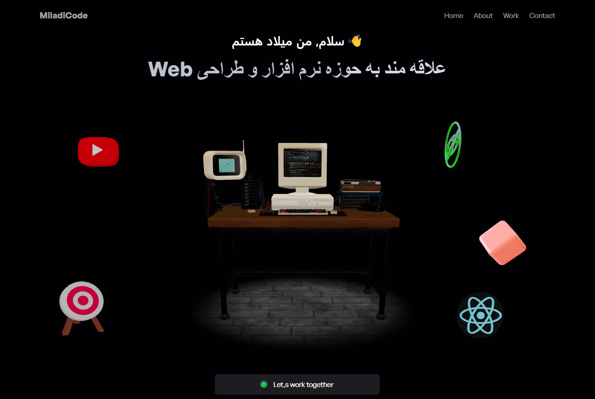
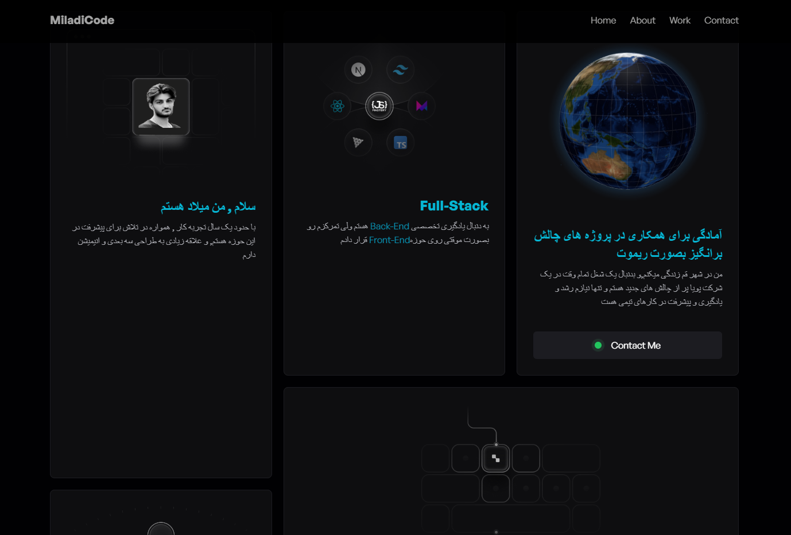
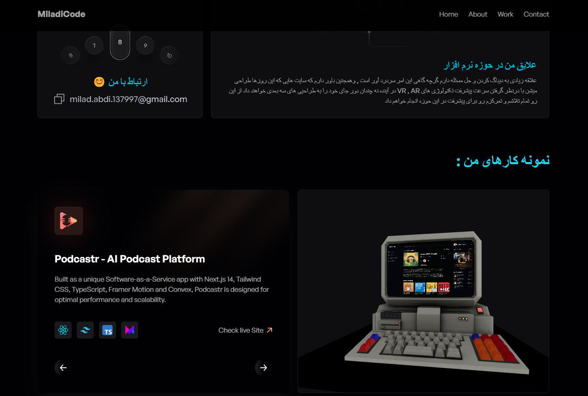
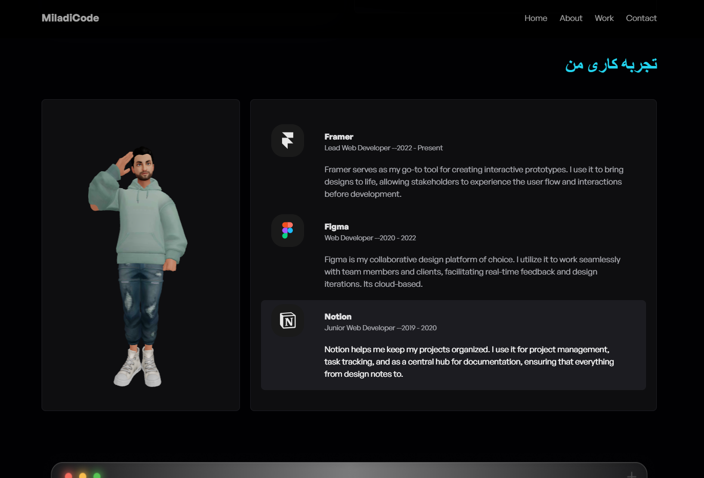

# 3D Portfolio WebSite

This template provides a minimal setup to get React working in Vite with HMR and some ESLint rules.

An amazing 3D Portfolio WebSite created by using  React, Three.js and TailwindCSS.

https://github.com/user-attachments/assets/0c8a4ae6-49ad-41dd-bd54-81db1e86e000

